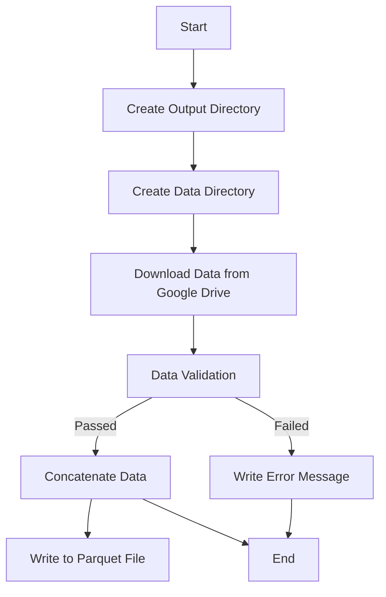

# Pipeline of the project:

## Steps to install and run the project:    
  
* Install poetry in case you don't have it in your machine:  
`pip install poetry` 

* Clone repository:  
`git clone https://github.com/thomasfsr/new_duck.git`  

*   Access the project directory:  
`cd transform_duck`  
  
*   Config python version 3.11.7:    
`pyenv local 3.11.7`  

*   initialize virtual environment with poetry:  
`poetry shell`  
  
*   Install poetry dependencies:  
`poetry install`  

::: app.extract_from_gdrive.create_data_dir

Pipeline of the project:  

